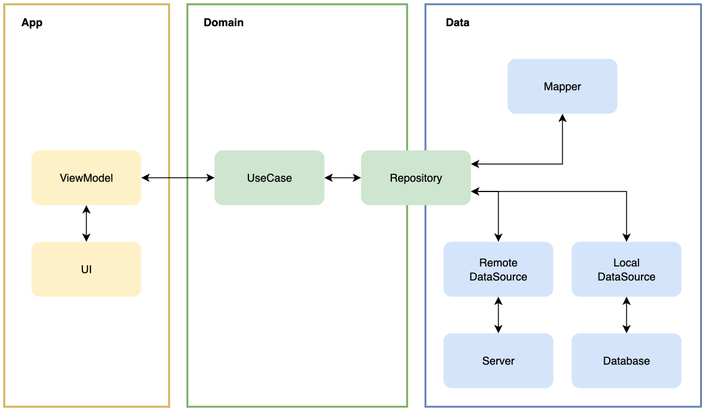

# 🎬 MovieTrends

> 최신 영화 트렌드를 확인할 수 있는 안드로이드 애플리케이션입니다.  
> Clean Architecture 기반으로 설계되었으며, UI는 Jetpack Compose로 구현했습니다.  
> TMDB API를 사용해 상영 중인 영화와 개봉 예정인 영화 데이터를 불러옵니다.  

## 🦾 Tech Stack

- **Kotlin**: 안드로이드 앱 개발에 사용되는 공식 언어입니다.
- **Jetpack Compose**: UI를 선언적으로 구현합니다.
- **Coroutines**: Kotlin의 비동기 작업을 처리합니다.
- **Flow**: 플랫폼에 종속적인 LiveData의 사용을 피하고, StateFlow와의 연동을 수월하게 합니다.
- **ViewModel**: UI 렌더링 시 필요한 상태 데이터를 관리하고 보관합니다.
- **UDF**: 상태는 아래로, 이벤트는 위로 향하도록 Unidirectional Data Flow 패턴을 적용해 UI의 데이터 소스를 하나로 유지하고 테스트를 수월하게 합니다.
- **Room**: 쿼리를 직접 작성하는 대신 객체를 통해 로컬 데이터를 관리하도록 합니다.
- **Paging3**: 데이터를 페이지 단위로 로드하며, 캐시 기능을 활용해 오프라인 환경에서의 사용성을 개선합니다.
- **Clean Architecture**: 앱을 계층별로 분리하여 확장에 유연하면서도 테스트하기 쉬운 구조를 만듭니다.
  - **Domain Layer**: 앱의 핵심 비즈니스 로직을 정의합니다.
  - **Data Layer**: 네트워크, 로컬 데이터베이스 등의 외부 소스로부터 데이터를 가져옵니다.
  - **App Layer**: 사용자 입력을 처리하고, UI에 상태를 반영합니다.
- **Hilt**: 의존성을 자동으로 주입해 테스트 가능한 구조의 코드를 구현합니다.
- **Unit Test**: 작은 단위의 코드를 독립적으로 검증합니다.
- **Integration Test**: 여러 컴포넌트가 함께 동작하는 시나리오의 흐름을 검증합니다.
- **Robolectric**: 디바이스 없이 JVM에서 UI 관련 테스트를 실행할 수 있게 합니다.

## 🛠️ Architecture

## ✅ Features

- **주간 추천 영화**
  - 한 주 동안 가장 많은 인기(Popularity) 점수의 평균값을 획득한 영화를 보여줍니다.
  - 커스텀 Composable인 도넛 차트(AnimatedDonutChart)를 통해 영화의 평점을 애니메이션으로 나타냅니다. 
- **상영 중인 영화**
  - 현재 상영 중인 영화 목록을 교차형 그리드(Staggered Grid) 형태로 보여줍니다.
  - Paging3의 RemoteMediator를 적용하여, 오프라인 환경에서도 캐시에 저장된 영화 데이터를 불러올 수 있도록 했습니다.
  - 영화의 id 값을 기반으로 랜덤한 화면비의 포스터를 사용하여 시각적인 역동성을 부여했습니다.
- **개봉 예정 영화** 
  - 개봉 예정에 있는 영화 목록을 리스트 형태로 보여줍니다.
  - Paging3를 적용하였으며 RemoteMediator 없이 순수하게 원격 데이터만을 사용해 페이징을 구현하였습니다.
  - 커스텀으로 구현한 Surface를 사용해 리스트의 각 아이템에 터치 효과를 부여했습니다.
- **영화 상세 정보**
  - 선택한 영화의 상세 정보를 보여주는 화면입니다.
  - 영화 제목, 평점, 개요 정보를 한 화면에 확인할 수 있습니다.
- **다국어 지원**:  
  - 시스템 설정이 한국어로 되어 있을 경우 한국어 리소스를 사용하되, 그 외의 언어는 영어를 디폴트로 적용합니다.
  - TMDB API 호출 시, 시스템 설정과 동일한 언어의 영화 데이터를 불러오도록 요청을 날립니다. (단, 한국어 정보가 없는 영화의 경우는 영문 데이터를 불러옵니다.) 
- **라이트/다크 모드 지원**
  - 디스플레이 설정에 맞춰 라이트/다크 모드를 적용합니다.
  - @Preview를 통해 라이트/다크 모드에 해당하는 각 UI 상태를 즉시 확인할 수 있습니다.
- **테스트**
  - 네비게이션을 사용한 화면 이동, 그리고 API 요청에 따른 응답이 화면에 반영이 되기까지의 과정을 확인할 수 있습니다.
  - Robolectric을 사용해 디바이스가 없는 환경에서도 테스트를 진행할 수 있도록 했습니다.
